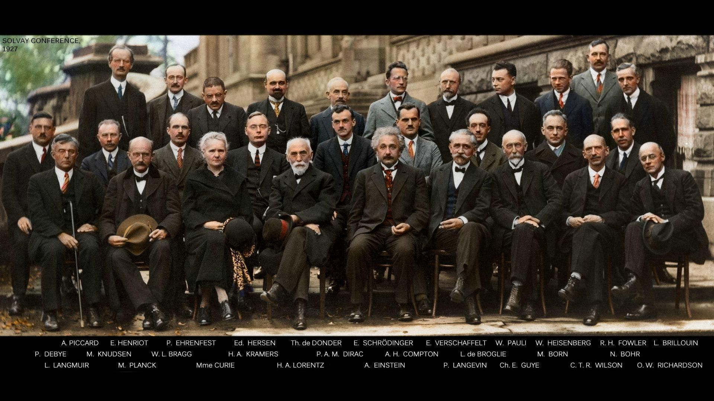

# Introducción a la Química Cuántica
La química actual depende fundamentalmente de la concepción moderna de la estructura atómico-molecular de la materia, basada en una formulación mecano-cuántica. Es entonces indispensable fortalecer la comprensión de esta aproximación al inicio del ciclo profesional, ya que su dominio facilita los procesos de aprendizaje de las demás ramas de la química, desde una perspectiva teórica sólida y coherente. En la figura de abajo se muestra una foto de la quinta conferencia de Solvay (1927), donde se consolidó el nacimiento de la teoría de la mecánica cuántica.

